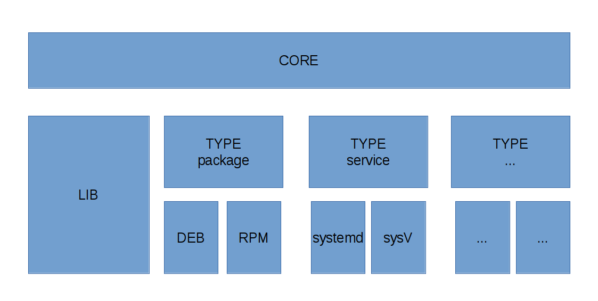

Architecture
============

Overview
--------

enSHure is split up into four major components: the core, the libraries (lib), the types and the
modules. This split can be seen as the core/, lib/, types/, and the modules/ directory in the source code.
Roughly the the sturcture looks like this:

Modules
-------

For **specific functionality** the code resides inside **a module**. You could call it
a plugin. The problems solved here are for example: "Installing a package using
apt", "Starting a systemd service at boot", "Creating a file with the correct
permissions", ...

Types
-----

The next components are the **types**. They fall somewhere in the middle between the
core and the modules. Types implement **shared functionality** between some of
the modules which solve the same problem but in a different way or on a different OS.
Examples would be: "Doing package management", "Managing services", "Creating users", ...

Core
----

**Reusable functionality for every module** resides into the **core** script. This
would be the main binary in the plugin analogy. The problems solved here are:
"Notifying the user", "Writing to the log file", "Querying the log", ...

Library
-------

**Reusable functionality shared by  some modules** should end up in the lib folder.
Here would be code that implements: "ini-style config manipulation",
"detection of the OS the script runs on", ...
